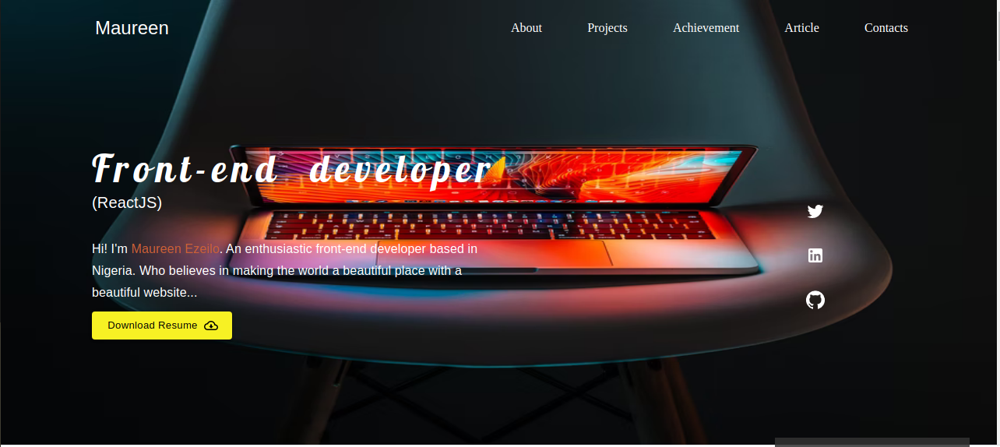

# My Portfolio Website
>My personal Portfolio

## Project Overview
>This project is a single-page application  which displays my skills, experience, and some examples of personal projects screenshots. Built using React, ReactHooks, Material-UI, JavaScript, HTML.

### Check out the Live demo [here]().

## Author

👤 **Obiageli Ezeilo**

- Github: [@oween](https://github.com/Moween)
- Twitter: [@iamMoween](https://twitter.com/iamMoweem)
- Linkedin: [Obiageli Ezeilo](https://www.linkedin.com/in/obiageli-ezeilo-0301ba152/)